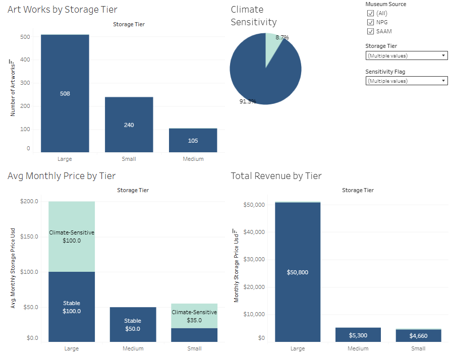

# 🖼️ Art Storage Pricing Model Dashboard

### Using museum inventory data to structure a real-world pricing model for a private art storage business.

This project was developed to support a **private client in the art industry**, helping them understand how to structure storage pricing tiers based on artwork size, material sensitivity, and preservation requirements. Data was sourced from national museum collections and cleaned in Excel, with insights visualized using Tableau Public.

---

## 🧾 Executive Summary

This dashboard answers four strategic pricing and planning questions for a boutique art storage startup:

1. **How many artworks fall into each storage tier?**
2. **What percentage of pieces require climate-controlled storage?**
3. **What is the average monthly storage price per tier?**
4. **Which storage tiers generate the most total revenue under the current pricing model?**

---
### 🖼 Dashboard Preview



---

### 📊 Dashboard Overview

- Visual insights include:
  - Tier distribution based on calculated artwork volume
  - Breakdown of climate-sensitive pieces across the inventory
  - Monthly price comparison by tier and sensitivity
  - Total revenue potential by storage tier (climate vs. stable)

> 🔗 [View the live dashboard on Tableau Public](https://public.tableau.com/views/ArtStoragePricingModelDashboard/ArtStoragePricingModel?:language=en-US&:sid=&:redirect=auth&:display_count=n&:origin=viz_share_link#)

---

### ✅ Actionable Recommendations

- **📦 Operations Insight:** Build more Small/Medium storage units to match actual demand tiers.
- **❄️ Risk/Preservation Insight:** Roughly 10% of the inventory requires climate-controlled storage — this justifies a premium tier or surcharge.
- **💵 Financial Insight:** Large pieces generate the most per-unit revenue, but Small units dominate in volume. A balanced model is recommended.
- **🎯 Strategy Insight:** Standardizing volume-based tiers aligns with both market trends and museum-grade conservation needs.

---

## 🔍 Deep Dive: Analytical Approach

### 🧮 Dataset Overview

- Datasets sourced from:
  - Smithsonian American Art Museum (SAAM)
  - National Portrait Gallery (NPG)
  - Publicly available art sales datasets
- Final combined dataset contains:
  - Artwork dimensions, materials, pricing tiers
  - Custom flags for sensitivity (climate risk)
  - Monthly pricing logic (base + climate fee)

---

### 💾 SQL-Based Analysis

- Custom table created using merged Excel outputs
- MySQL used to:
  - Count artwork frequency by volume tier
  - Measure climate-sensitive breakdown
  - Average pricing logic across all tiers
  - Aggregate potential monthly revenue

---

## 📁 SQL Scripts

All scripts used to analyze the final merged dataset:

- [01_create_table.sql](./sql/01_create_table.sql)
- [02_q1_storage_tier_count.sql](./sql/02_q1_storage_tier_count.sql)
- [03_q2_climate_sensitivity_breakdown.sql](./sql/03_q2_climate_sensitivity_breakdown.sql)
- [04_q3_avg_price_by_tier.sql](./sql/04_q3_avg_price_by_tier.sql)
- [05_q4_total_revenue_by_tier.sql](./sql/05_q4_total_revenue_by_tier.sql)

---

## 🛠️ Tools Used

- **Excel + Power Query:** Data cleaning and transformation
- **SQL (MySQL dialect):** Table creation and business queries
- **Tableau Public:** Executive dashboard and stakeholder visualizations

---

## 📁 Repository Structure

```
art-storage-pricing-model/
│
├── sql/
│   ├── 01_create_table.sql
│   ├── 02_q1_storage_tier_count.sql
│   ├── 03_q2_climate_sensitivity_breakdown.sql
│   ├── 04_q3_avg_price_by_tier.sql
│   └── 05_q4_total_revenue_by_tier.sql
│
├── data/
│   └── Museum_Pricing_Combined.xlsx       # Combined SAAM + NPG data
│
├── images/
│   └── dashboard_preview.png              # Tableau dashboard preview (optional)
│
├── README.md                              # Project documentation
└── LICENSE                                # Repository license
```

---

## 👋 About the Analyst

**Jeremy Gutierrez**  
Freelance Data Analyst working on portfolio-building projects across the arts, healthcare, and marketing industries.  
Focused on stakeholder-first design and clean data storytelling.  
[Connect on LinkedIn](https://www.linkedin.com/in/jeremy-gutierrez-4502391bb/) • [View GitHub Portfolio](https://github.com/JZambrana1612)
